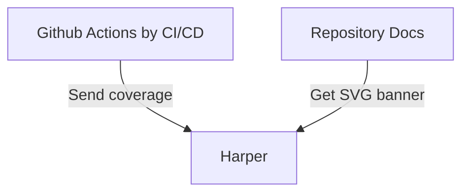

# Harper
[](https://harper.quantcore.space/v1/info/temapskov/harper/banner.svg)
___

`Harper` это помощник для разработчиков, который сможет помочь в решении различных
задач, связанных с разработкой программного обеспечения.

На текущий момент реализован функционал хранения и выдачи информации о процентном
покрытии репозитория тестами в виде `SVG`-баннера. Что позволяет не хранить в репозитории
различные отчеты и изображения для отображения процентного покрытия кода тестами в репозитории.


## Интерфейс

### Использование генератора баннеров Coverage

Сервис позволяет динамически отдавать показатель покрытия кода тестами в виде svg-баннера `Coverage`.

Данный сервис хранит информацию о проценте покрытия кода для репозитория в формате `key=value`, где ключом выступает название репозитория (вместе с пользователем (или организацией), например `temapskov/test` или `team/test`).




Для сохранения информаци в `key=value` хранилище у сервиса доступен эндпоинт `GET /v1/info/?repo_name=test&value=91`, о нем написано ниже.

Для получения баннера svg-изображения нужно обратиться к эндпоинту `GET /v1/info/{ORG_NAME}/{REPO_NAME}/banner.svg`. Данное изображение можно добавить в документацию к проекту.

#### Описание использования

1. В проекте имеется GitHub Action, который подсчитывает процент покрытия кода тестами и отправляет данный результат в Harper.
2. В документации к проекту добавлен баннер с постоянной ссылкой на сервис `Harper`, пример баннера:
```Markdown

```
3. При выполнение Actions всегда будут обновляться данные для репозитория в сервисе `Harper`
4. При запросе документации будет осуществлен запрос на получение изображения из сервиса `Harper` с актуальным процентом покрытия кода тестами в виде баннера

> [!NOTE]
>
> Возможны задержки отрисовки новых показателей баннере.
>
> GitHub кэширует изображения на своих серверах, по этому скорость отрисовки новых показателей не будет моментальной.


### REST API

#### `GET /v1/ping`

Эндпоинт для проверки работоспособности приложения.

Ответ:
```JSON
{
    "message": "pong"
}
```

#### `GET /v1/info/?repo_name=test&value=91`

Эндпоинт для сохраниния информации о процентном покрытии репозитория тестами.

Параметры:
- `repo_name` - название репозитория (строка)
- `value` - количество процентов (число)

Данный узел сохраняет информацию в базе данных приложения в формате ключ-значение.

#### `GET /v1/info/{ORG_NAME}/{REPO_NAME}/banner.svg`

Эндпоинт для получения баннера по имени репозитория, если такого не существует
вернется баннер со значением 0.

- `{ORG_NAME}` - имя пользователя или организации, например `hashicorp`
- `{REPO_NAME}` - название репозитория, например `vault`

Пример полного адреса: `https://harper.quantcore.space/v1/info/hashicorp/vault/banner.svg`

Ответ:
```svg
<svg xmlns="http://www.w3.org/2000/svg" xmlns:xlink="http://www.w3.org/1999/xlink" width="99" height="20">
  <linearGradient id="b" x2="0" y2="100%">
    <stop offset="0" stop-color="#bbb" stop-opacity=".1"/>
    <stop offset="1" stop-opacity=".1"/>
  </linearGradient>
  <mask id="a">
    <rect width="99" height="20" rx="3" fill="#fff"/>
  </mask>
  <g mask="url(#a)">
    <path fill="#555" d="M0 0h63v20H0z"/>
    <path fill="#9f9f9f" d="M63 0h36v20H63z"/>
    <path fill="url(#b)" d="M0 0h99v20H0z"/>
  </g>
  <g fill="#fff" text-anchor="middle" font-family="DejaVu Sans,Verdana,Geneva,sans-serif" font-size="11">
    <text x="31.5" y="15" fill="#9f9f9f" fill-opacity=".6">coverage</text>
    <text x="31.5" y="14">coverage</text>
    <text x="80" y="15" fill="#9f9f9f" fill-opacity=".6">0%</text>
    <text x="80" y="14">0%</text>
  </g>
</svg>
```

Вышеуказанный `SVG` код генерируется программой, в зависимости от процентного покрытия
может отличаться цветовая схема баннера.
